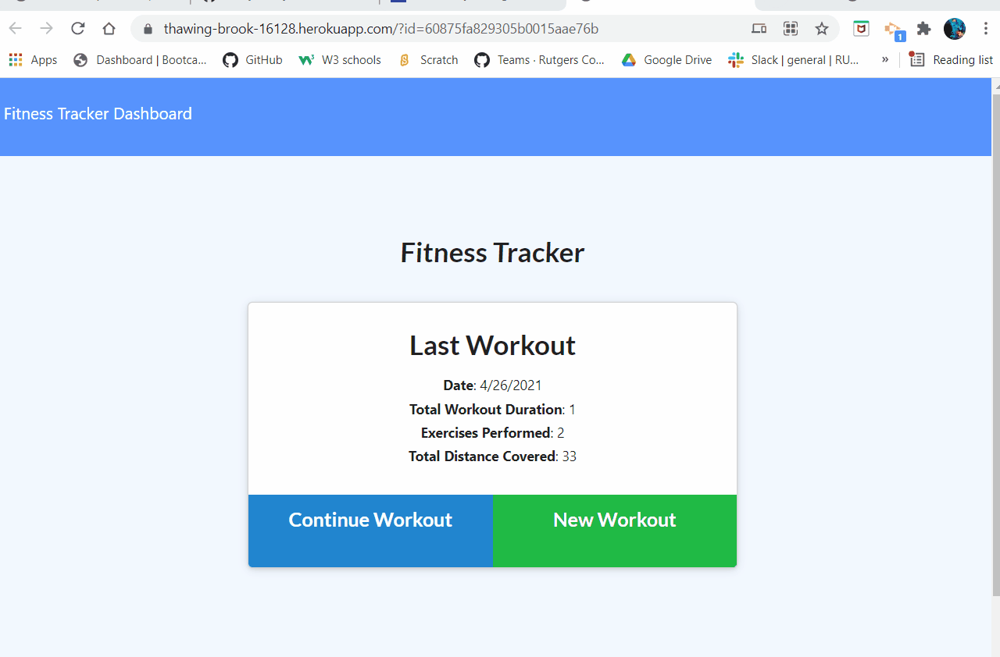

# workoutTracker
* Description
       - As a user, he/she should be able to add as many workouts as we want and track rack the stats of those workouts for each day. There is two workout options of resistance training or cardio training. The dashboard is designed to display the total duration of the workouts entered and the weight of the resistance training workouts.
* Table of Contents
  - Description
  - links
  - technology used
  - Licenses
  - Contact information.

* Links
 - [Url](https://ramyamariyala.github.io/workoutTracker/)
 - [heroku](https://thawing-brook-16128.herokuapp.com/)
 - [Github](https://github.com/Ramyamariyala/workoutTracker.git)

   
   

* Technology used
 - Visual Studio Code https://code.visualstudio.com
 - Create a package using npm init -y
 - Install express package https://www.npmjs.com/package/express
 - Install file system package https://www.npmjs.com/kagefile-system

* License
 MIT
 
* Conact information 
 - Name: Ramya Mariyala
 - Email : ramya.mariyala@gmail.com
 
 

